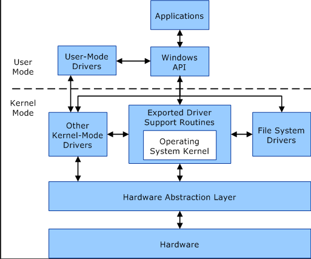

<h1 align="center">SO1 - Fredy Quijada - 202004812</h1>

El hardware y software son dos caras diferentes de una misma moneda, pero, ¿alguna vez te preguntaste qué los comunica? Hoy te traemos la respuesta a esta pregunta que quizás alguna vez pasó por tu cabeza: el Kernel.

Este núcleo es la parte central del sistema operativo que hace de puente entre software y hardware, pero todavía hay mucho más por contar. 

## Tabla de contenidos

- [Kernel](#kernel)
  - [¿Qué es un Kernel?](#¿qué-es-un-kernel?)
- [Tipos de Kernel](#tipos-de-kernel)
  - [Esenciales](#esenciales)
    - [Kernel monolítico](#kernel-monolítico)
    - [Microkernel](#microkernel)
    - [Kernel híbrido](#kernel-híbrido)
  - [No Esenciales](#no-esenciales)
    - [Nanokernel](#nanokernel)
    - [Exokernel](#exokernel)
    - [Unikernel](#unikernel)
    - [Anykernel](#anykernel)
- [User Mode vs Kernel Mode](#user-mode-vs-kernel-mode)
  - [User Mode](#user-mode)
  - [Kernel Mode](#kernel-mode)
- [Interrupciones vs Trampas](#interrupciones-vs-trampas)
  - [Interrupciones](#interrupciones)
  - [Trampas](#trampas)

## Kernel
Toda aquella persona que trabaja con un sistema operativo también trabaja con Kernel, muchas veces, sin darse cuenta o saberlo, pero tiene un trabajo importante al comunicar el software y el hardware. Y es que Kernel es la parte encargada de todos los aspectos de organización de los procesos y datos de cada ordenador que se realiza en segundo plano. 

Para que se entienda mejor, son como las venas o el corazón que permiten el flujo de sangre (información, datos, comandos o como se prefiera llamarlos) del ordenador.

Al ser el núcleo del sistema operativo, hace de interfaz comunicando el software y el hardware, razón por lo que se usa en todo momento. Es por ello que se refiere a este muchas veces como el corazón del sistema operativo. Pero, ¿es todo lo que hace? Pues no. El corazón no solo bombea sangre en el cuerpo humano, sino que también la limpia. De la misma forma, el Kernel controla todos los accesos al procesador y la memoria, pero también es responsable de los drivers (controladores) más importantes y tiene la capacidad de acceder a los hardwares de forma directa.

Si tuviésemos que llegar a una conclusión de todo esto, Kernel es la base que permite la interacción entre hardware y software, gestionando los recursos de la manera más eficiente que se pueda.

### ¿Qué es un Kernel?
Sin entrar en tecnicismos y definiéndolo de manera clara y simple: un complemento que se encuentra en el centro del sistema operativo que hace de interfaz entre el usuario y la máquina. 

Está encargado de todas las funciones de mayor relevancia del hardware, sin importar cuál sea el sistema operativo, Linux, macOS, Windows, servidores, virtualizaciones como KVM, hasta los smartphone tiene un Kernel en el núcleo que permite que se pueda abrir WhatsApp.

Viéndolo de otra manera, el Kernel es el que da o transmite órdenes. Poniéndo de ejemplo que se escribe un mensaje en la aplicación de WhatsApp, pues en el núcleo se recibe un System Call al momento de escribir. Mientras el usuario está tocando las teclas en la pantalla del móvil, el Kernel está procesando todo eso para convertirlo en el lenguaje de la máquina y enviarlo al CPU. Esto es gracias a que el Kernel es capaz de controlar todas las órdenes que recibe el dispositivo. 

Aunque en este ejemplo anterior se ve lento, la verdad es que todo ocurre en cuestión de milisegundos y en un segundo plano donde el usuario, ni siquiera se entera.

## Tipos de Kernel
Se dividen en dos tipos, esenciales y no esenciales. ¿Qué quiere decir esto? Que algunos tienen un uso más común que otros, pero definiéndolos de una forma general:

### Esenciales

#### 1. Kernel monolítico: 
Es un Kernel de gran tamaño que puede gestionar todas las tareas. Se encarga de la gestión de memoria y procesos, así como de la comunicación entre los procesos y el soporte de las diferentes funciones de los drivers y el hardware. Los sistemas operativos que recurren al Kernel monolítico son Linux, OS X y Windows.

#### 2. Microkernel: 
Los Kernel que están diseñados con pequeños tamaños tienen una clara función: evitar el colapso total del sistema en caso de un fallo. Para cumplir con todas las tareas como un Kernel monolítico cuenta con diferentes módulos. Es curioso, pero hasta ahora solo el Mach de OS X es el único que utiliza el microkernel.

#### 3. Kernel híbrido: 
Combinación entre el microkernel y el Kernel monolítico. Nos encontramos ante un Kernel grande, pero compacto y que puede ser modulado y otras partes del mismo Kernel pueden cargarse de manera dinámica. Es utilizado en Linux y OS X. 

### No Esenciales

#### 1. Nanokernel: 
Si el microernel es pequeño, este es todavía más reducido, pero su uso está destinado a sistemas embebidos ya que el nivel de fiabilidad es mayor.

#### 2. Exokernel: 
La estructura que propone un exokernel es innovadora ya que se estructura de manera vertical. Los núcleos son pequeños y su desarrollo tiene fines investigativos. En un exokernel la toma de decisiones está a cargo de los programas, para hacer el uso de los recursos del hardware en ciertas bibliotecas. El Kernel se limita a evitar errores en los permisos de hardware y eludir conflictos.

#### 3. Unikernel: 
Es un Kernel destinado a la eliminación de capas intermedias entre el hardware y las aplicaciones, ya que busca simplificar lo más posible todos los procesos. Es habitual en dispositivos de bajo consumo como los IoT.

#### 4. Anykernel: 
Otro concepto innovador que busca conservar las cualidades de los Kernel monolíticos, pero también facilitar el desarrollo de los controladores, al mismo tiempo que ofrece mayor seguridad al usuario. 

## User Mode vs Kernel Mode
Un procesador en una computadora que ejecuta Windows funciona en dos modos diferentes: modo de usuario y modo kernel. El procesador cambia entre estos modos dependiendo del tipo de código que está ejecutando. Las aplicaciones funcionan en modo usuario, mientras que los componentes centrales del sistema operativo funcionan en modo kernel. Aunque muchos controladores operan en modo kernel, algunos pueden funcionar en modo usuario.

### User Mode
Cuando inicia una aplicación en modo usuario, Windows crea un proceso por ello. Este proceso proporciona a la aplicación un espacio de direcciones virtual y un privado mesa de manija. Dado que el espacio de direcciones virtuales de cada aplicación es privado, una aplicación no puede modificar los datos de otra aplicación. Cada aplicación se ejecuta de forma aislada, lo que garantiza que si se bloquea, no afecte a otras aplicaciones o al sistema operativo.

El espacio de direcciones virtual de una aplicación en modo de usuario también está limitado. Un proceso que se ejecuta en modo usuario no puede acceder a las direcciones virtuales que están reservadas para el sistema operativo. Limitar el espacio de direcciones virtuales de una aplicación en modo de usuario evita que la aplicación modifique o dañe los datos críticos del sistema operativo.

### Kernel Mode
Todo el código que se ejecuta en modo kernel comparte un solo espacio de direcciones virtual. Como resultado, un controlador en modo kernel no está aislado de otros controladores o del sistema operativo. Si un controlador en modo kernel escribe erróneamente en la dirección virtual incorrecta, podría comprometer los datos que pertenecen al sistema operativo u otro controlador. Si un controlador en modo kernel se bloquea, hace que todo el sistema operativo se bloquee.

El siguiente diagrama ilustra la comunicación entre los componentes de modo de usuario y de modo de kernel.

## Interrupciones vs Trampas

### Interrupciones
Las interrupciones son señales emitidas por el software o el hardware cuando un proceso o evento requiere atención inmediata. Debido a que tanto el hardware como el software generan estas señales, se las conoce como interrupción por hardware y por software. Las interrupciones pueden ser causadas por un dispositivo USB, una tarjeta NIC o un teclado. Las interrupciones ocurren asincrónicamente, y pueden ocurrir en cualquier momento.

Un pin de interrupción es un pin dedicado en una CPU. También se conoce como el pin INT. El pin de interrupción conecta dispositivos como teclados al procesador. Cuando se hace clic en una tecla, se produce la interrupción. La CPU pasará del proceso actual a una Rutina de Manejo de Interrupciones. En este caso, se está produciendo la rutina del controlador de interrupción del teclado. Después de terminar el código del controlador de interrupciones, la CPU vuelve al programa original que se estaba ejecutando. Cuando llega una interrupción, la CPU cambia el contexto y ejecuta el controlador de interrupciones. Vuelve al estado anterior después de la finalización.

Una CPU tiene un solo pin de interrupción, pero hay varios dispositivos de hardware. El controlador de interrupción permite que varios pines compartan un solo pin de interrupción. Para identificar qué dispositivo causó la interrupción, el procesador interactuaría con el controlador de interrupción, ejecutando el procedimiento de controlador de interrupción apropiado. Podría ser un método para manejar interrupciones de temporizador, USB o teclado.

Múltiples instrucciones se ejecutan en un programa, y el tiempo que tarda un programa en ejecutar una instrucción del programa se conoce como el ciclo de instrucción. Los dispositivos de E/S o los programas de usuario pueden generar interrupciones mientras la CPU ejecuta las instrucciones del programa. Estas interrupciones se le pasarían como entrada mientras la CPU está ejecutando las instrucciones del programa.

El procesador gestiona las interrupciones comprobando si hay o no una interrupción pendiente para tomar medidas después de cada ciclo de instrucción. Si la CPU no identifica ninguna interrupción pendiente, procederá a la siguiente instrucción del programa. Si la CPU identifica una interrupción pendiente, detendrá la ejecución de la instrucción e invocará el programa del controlador de interrupciones para servir la interrupción pendiente.

### Trampas
El programa de usuario realiza trampas para invocar la funcionalidad del sistema operativo. Supongamos que la aplicación del usuario requiere que se imprima algo en la pantalla, y eso desencadenaría una trampa, y el sistema operativo escribiría los datos en la pantalla.

Una trampa es una interrupción producida por software que puede ser causada por varios factores, incluido un error en la instrucción, como la división por cero o el acceso ilegal a la memoria. También se puede generar una trampa cuando un programa de usuario realiza una solicitud de servicio definida desde el sistema operativo.

Se llaman trampas síncrono eventos porque la ejecución de las presentes instrucciones es mucho más probable que cause trampas. Las llamadas al sistema son otro tipo de trampa en la que el programa le pide al sistema operativo que busque un determinado servicio, y el sistema operativo posteriormente genera una interrupción para permitir que el programa acceda a los servicios.

Las trampas son más activas como una interrupción porque el código dependerá en gran medida del hecho de que la trampa se puede utilizar para interactuar con el sistema operativo. Por lo tanto, las trampas repetirían la función de la trampa para acceder a cualquier servicio del sistema.

El programa de usuario en la CPU generalmente utiliza llamadas de biblioteca para realizar llamadas al sistema. El trabajo de la comprobación de rutina de la biblioteca es validar los parámetros del programa, crear una estructura de datos para transferir los argumentos de la aplicación al núcleo del sistema operativo, y luego ejecute instrucciones especiales conocidas como trampas o interrupciones de software.

Estas instrucciones o trampas especiales tienen operandos que ayudan a determinar qué servicio de kernel requieren las entradas de la aplicación. Como resultado, cuando el proceso está configurado para ejecutar las trampas, la interrupción guarda el estado del código de usuario, cambia al modo supervisor, y luego envía el procedimiento del kernel relevante que puede ofrecer el servicio solicitado.