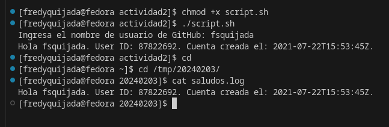

<h1 align="center">SO1 - Fredy Quijada - 202004812</h1>

# Ejecución de Script
Para poder realizar la ejecución del script creado, se deben de seguir los siguientes pasos:

- Abrir una terminal en la ruta en donde se encuentra el archivo .sh.
- Luego se deben de otorgar permisos para su ejecución:

```bash
chmod +x script.sh
```
- Luego se ejecuta dicho archivo
```bash
./script.sh
```

## Ejemplo del script en la terminal




# Crear un cronjob
Para crear un cronjob para ejecutar el script anterior cada 5 minutos se realiza lo siguiente:

- Se utiliza el editor de preferencia y se ingresa el siguiente comando:
```bash
crontab -e
```

- Luego se ingresa la ruta en la que se encuentra el script
```bash
<rutaCarpetas>/.script.sh
```

- Si se desea visualizar el contenido actual de crontlab
```bash
crontlab -l
```
- Si se desea eliminar todo el contenido de crontjobs
```bash
crontab -r
```
