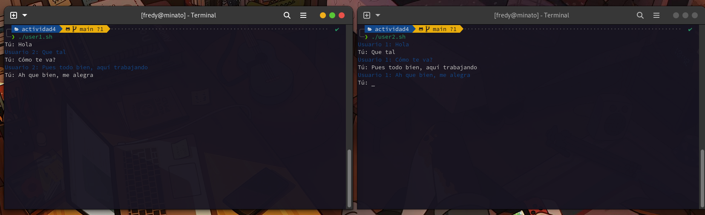

<h1 align="center">SO1 - Fredy Quijada - 202004812</h1>

# Chat Básico con Named Pipes
Para realizar este chat se deben de crear dos scripts que representarán a cada usuario.

## Script 1
El script lo llamaremos `user1.sh` y tendrá el siguiente contenido:
```bash
#!/bin/bash

# Definir las direcciones de los named pipes
PIPE_FROM_USER1="user2_to_user1"
PIPE_TO_USER1="user1_to_user2"
# Colores para la conversacion
GREEN='\033[0;32m'
BLUE='\033[0;34m'
NC='\033[0m'

# Crear los named pipes si no existen
if [ ! -p "$PIPE_FROM_USER1" ]; then
    mkfifo "$PIPE_FROM_USER1"
fi

if [ ! -p "$PIPE_TO_USER1" ]; then
    mkfifo "$PIPE_TO_USER1"
fi

# Ciclo infinito del usuario 1
while true; do
    # Solicitar mensaje a enviar
    read -p "Tú: " message
    # Enviar mensaje al usuario 2
    echo -e "${BLUE}Usuario 1: $message${NC}" > "$PIPE_TO_USER1"

    # Leer y mostrar el mensaje del usuario 2
    read message < "$PIPE_FROM_USER1"
    echo -e "${BLUE}Usuario 2: $message${NC}"
done
```

## Script 2
El script lo llamaremos `user2.sh` y tendrá el siguiente contenido:
```bash
#!/bin/bash

# Definir las direcciones de los named pipes
PIPE_FROM_USER2="user1_to_user2"
PIPE_TO_USER2="user2_to_user1"
# Colores para la conversacion
BLUE='\033[0;34m'
NC='\033[0m'

# Crear los named pipes si no existen
if [ ! -p "$PIPE_FROM_USER2" ]; then
    mkfifo "$PIPE_FROM_USER2"
fi

if [ ! -p "$PIPE_TO_USER2" ]; then
    mkfifo "$PIPE_TO_USER2"
fi

# Ciclo infinito del usuario 2
while true; do
    # Leer y mostrar el mensaje del usuario 1
    read message < "$PIPE_FROM_USER2"
    echo "$message"

    # Solicitar mensaje a enviar
    read -p "Tú: " message
    # Enviar mensaje al usuario 1
    echo "$message" > "$PIPE_TO_USER2"
done
```

## Otorgar permisos
Estando en la ruta de la carpeta en donde creamos los scripts, ejecutamos el siguiente comando:
```bash
chmod +x script.sh
```

## Ejecutar scripts
En dos terminales distintas ejecutamos cada script de la siguiente manera:

### Terminal 1
```bash
./user1.sh
```

### Terminal 2
```bash
./user2.sh
```

## Prueba de Chats




